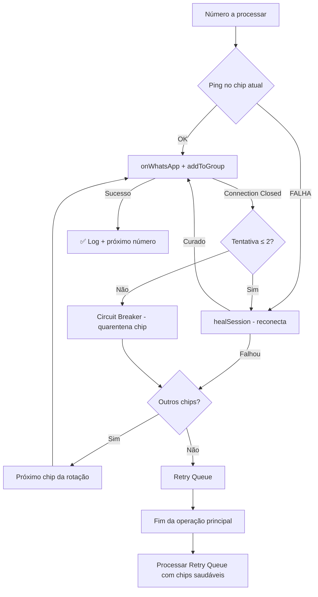

# Solução Robusta para "Connection Closed" no ADD_TO_GROUP

## Diagnóstico

Analisei profundamente os logs e o código. O padrão é claro:

| Observação | Evidência |
|---|---|
| **Falhas em ~2000ms** | 95% das falhas ocorrem entre 2005ms-2046ms — é o timeout do WebSocket do Baileys |
| **Cascata de falhas** | Uma vez que começa a falhar, TODOS os números seguintes falham (a conexão morreu) |
| **Nenhuma tentativa de cura** | O `addToGroup` atual captura o erro e loga, mas **não tenta reconectar o chip** |
| **Contraste com `sendMsgToGroupMembers`** | O SEND_MSG já tem lógica de "cura total" (linhas 448-460), mas o ADD_TO_GROUP **não tem** |
| **Chip continua iterando morto** | Mesmo com a conexão caída, o loop continua usando o chip morto para os próximos números |

> [!CAUTION]
> **A raiz do problema**: O método `addToGroup` (linha 278 do `whatsapp-tasks.ts`) simplesmente faz `catch`, loga o erro e avança para o próximo número **sem verificar se o chip ainda está vivo**. Isso causa uma cascata onde dezenas de números falham em sequência porque o socket está morto.

## Proposed Changes

### Camada 1: WhatsApp Manager — Socket Health & Auto-Healing

#### [MODIFY] [whatsapp-manager.ts](file:///c:/Users/ROGERIO/Documents/trae_projects/X360C/src/lib/whatsapp-manager.ts)

**1. Backoff Exponencial na reconexão automática**
- Substituir o `setTimeout(() => this.createSession(...), 3000)` fixo por um **backoff exponencial** (3s → 6s → 12s → max 60s)
- Evita que o WhatsApp veja reconexões compulsivas em loop

**2. Método `pingSession()` público**
- Novo método leve que faz um ping real ao servidor do WhatsApp
- Retorna `true/false` sem side-effects pesados
- Usado pelo `addToGroup` antes de cada operação

**3. Método `healSession()` público**
- Encapsula a lógica de "detectar socket morto → reconectar → esperar READY"
- Implementa **timeout configurável** (default 15s) para a reconexão
- Retorna o socket curado ou `undefined`

**4. Keep-alive mais agressivo durante operações**
- O heartbeat atual é de 30s (`sendPresenceUpdate('available')`)
- Adicionar um método `startAggressiveKeepAlive(sessionId)` que reduz para **10s** e adiciona um `ping` real intercalado
- Chamado pelo addToGroup no início da operação e parado no fim

---

### Camada 2: WhatsApp Tasks — Lógica de Resiliência

#### [MODIFY] [whatsapp-tasks.ts](file:///c:/Users/ROGERIO/Documents/trae_projects/X360C/src/lib/whatsapp-tasks.ts)

**1. Health Check pré-número**
- Antes de processar cada número, fazer `pingSession()` no chip atual
- Se falhar: heal automático antes de prosseguir

**2. Auto-Healing no catch do ADD_TO_GROUP (CRÍTICO)**
- Aplicar a mesma lógica que já existe no `sendMsgToGroupMembers` (linhas 448-460)
- Se o erro for "Connection Closed" → `healSession()` → retry do número atual
- Max 2 tentativas por número

**3. Circuit Breaker por Chip**
- Se um chip falhar **3 vezes consecutivas**, ele é marcado como "em quarentena"
- O sistema o remove da rotação temporariamente
- Após 30s tenta reconectar e, se funcionar, re-insere na rotação
- Isso evita que um chip morto consuma slots de números bons

**4. Retry Queue para falhas de conexão**
- Números que falharam especificamente por "Connection Closed" são **colocados em fila de retry**
- Ao final da operação principal, tenta novamente esses números (com chip diferente se possível)
- Máximo 1 retry por número

**5. Keep-alive durante a operação inteira**
- No início do `addToGroup`, ativar `startAggressiveKeepAlive` para todos os chips ativos
- No fim (ou em caso de erro), parar o keep-alive

---

### Camada 3: API Route — Timeout protection

#### [MODIFY] [route.ts](file:///c:/Users/ROGERIO/Documents/trae_projects/X360C/src/app/api/tasks/groups/add/route.ts)

- Adicionar heartbeat na stream SSE (ping a cada 15s) para manter a conexão HTTP viva durante operações longas
- Isso evita que proxies/load balancers fechem a conexão por inatividade

---

### Camada 4: Controle de Concorrência de ADD_TO_GROUP

#### [MODIFY] [whatsapp-tasks.ts](file:///c:/Users/ROGERIO/Documents/trae_projects/X360C/src/lib/whatsapp-tasks.ts)

> [!IMPORTANT]
> O WhatsApp é extremamente sensível a adições simultâneas vindas do mesmo IP. Mesmo com chips diferentes, se as operações caírem no mesmo instante, o servidor marca o IP.

**Fila Única Serializada com Inter-Chip Delay**
- Todas as operações de `groupParticipantsUpdate` passam por uma **fila única global** (mutex)
- Entre operações de **chips diferentes**, um delay extra de 2-4s é injetado ("inter-chip jitter")
- Isso garante que mesmo com 5 chips, nunca há 2 chamadas de ADD simultâneas no mesmo IP
- A fila é implementada como um `AsyncQueue` simples com `Promise` encadeada

---

### Camada 5: Tratamento Inteligente de `not-authorized`

#### [MODIFY] [whatsapp-tasks.ts](file:///c:/Users/ROGERIO/Documents/trae_projects/X360C/src/lib/whatsapp-tasks.ts)

> [!WARNING]
> O erro `not-authorized` (geralmente em ~6877ms) indica que o chip perdeu admin ou a sessão foi invalidada remotamente pelo WhatsApp. Reconectar **não resolve** — precisa de tratamento diferenciado.

**Classificação de erros em 3 categorias:**

| Categoria | Exemplos | Ação |
|---|---|---|
| `NETWORK` | Connection Closed, timeout, socket hang up | healSession() + retry |
| `AUTH` | not-authorized, 401, logged out | Remover chip da rotação + notificar UI |
| `RATE_LIMIT` | 429, too many requests | Pausar TODOS os chips por 60s |

- O `healSession()` verifica a categoria antes de agir
- Se for `AUTH`: não tenta reconectar (seria inútil), marca o chip como `QUARANTINED_AUTH` e envia evento para a UI
- Se for `RATE_LIMIT`: pausa global com countdown visível na UI

---

## Resumo Visual das Mudanças

## Verificação

### Testes Automatizados
- Rodar a ferramenta com uma lista de 20+ números e verificar nos logs:
  - Zero cascatas de "Connection Closed" consecutivos
  - Mensagens de "healSession" aparecendo no terminal quando um chip cai
  - Circuit breaker entrando em ação se um chip persistir offline
  - Retry queue processando números no final

### Validação Manual
- Executar uma operação longa (50+ números) e observar:
  - O sistema deve rodar **horas sem parar**
  - Se um chip desconectar, os outros assumem automaticamente
  - Números que falharam por conexão devem ser re-tentados
